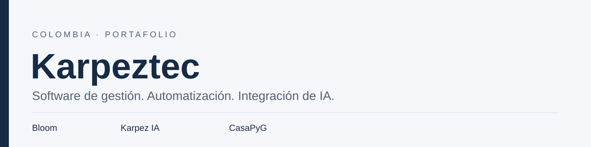
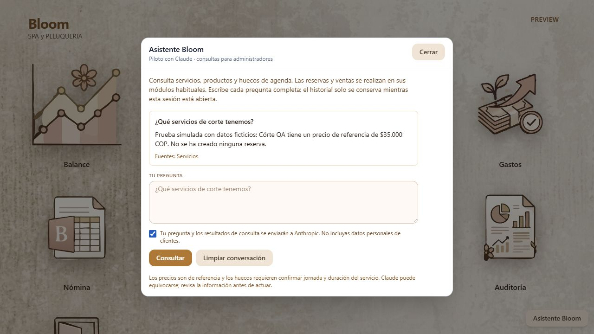
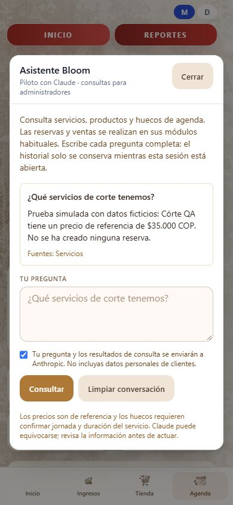

# Karpeztec · Portafolio de proyectos

Desarrollamos software de gestión y proyectos de automatización en Colombia. Fundador: **Carlos Padilla**. Karpeztec comenzó a operar en **marzo de 2025**, a partir de una idea nacida durante la universidad en 2016.

Esta presentación reúne productos, prototipos y evidencia de desarrollo. El código de los productos y los datos del negocio se mantienen privados.

| Proyecto | Propósito | Estado al 8 de octubre de 2026 |
| --- | --- | --- |
| [Bloom](projects/bloom.md) | Gestión de SPA y peluquería: agenda, ingresos, tienda y comisiones | En uso en un salón real, según su fundador. Asistente Claude en pruebas locales. |
| [Karpez IA](projects/karpez-ia.md) | Entorno para trabajar con modelos locales y adaptadores de proveedores | En desarrollo; integración comercial y validación de proveedores pendientes. |
| [CasaPyG](projects/casapyg.md) | Monitorización y automatización del hogar | Prototipo; integración y validación con dispositivos pendientes. |

## Bloom: de la gestión diaria a un asistente conectado

Bloom combina **Next.js, TypeScript, FastAPI y SQLite** para organizar las operaciones del salón. Estamos preparando una integración con Claude para consultar servicios y precios, productos y disponibilidad de agenda mediante herramientas controladas por permisos.

La integración está implementada localmente para administradores y en modo de consulta. Las pruebas utilizaron respuestas simuladas de Claude y datos ficticios. **La llamada real a la API y el despliegue del asistente siguen pendientes.**

### Captura real del piloto local · escritorio

### Captura real del piloto local · móvil

Las capturas corresponden a la interfaz implementada, no a una demostración de uso real de la API. Se verificaron permisos, restricciones de herramientas, idempotencia, límites de uso y omisión de nombres y teléfonos de clientes en resultados de herramientas; 13 pruebas automatizadas, TypeScript y ESLint aprobados.

## Dirección de desarrollo

- Bloom: validar un piloto con Claude antes de ampliar a atención a clientes adultos y más salones.
- Karpez IA: consolidar el entorno local y comprobar cada adaptador de proveedor.
- CasaPyG: validar escenarios de monitorización y automatización con dispositivos reales.

## Contacto

**Carlos Padilla · Fundador de Karpeztec**  
[ingpadceo@karpeztec.com](mailto:ingpadceo@karpeztec.com) · [LinkedIn](https://www.linkedin.com/in/carlos-padilla-6a4a4a162/)

Para conocer Bloom, solicita una presentación por el correo empresarial. [Acceso para usuarios de Bloom](https://app.bloomsalonypeluqueria.com/login?next=%2F).

### English overview

Karpeztec is a Colombian software and automation venture operating since March 2025. Bloom is used in one real salon, as confirmed by its founder. Its admin-only, read-only Claude integration has been implemented locally and tested with simulated responses and fictional data; live API validation and deployment are pending. Karpez IA and CasaPyG are development projects. This repository contains presentation materials, not product source code.

© 2026 Carlos Padilla / Karpeztec. Derechos reservados. Véase [aviso de uso](NOTICE.md). Esta vitrina no implica asociación, certificación ni aprobación por Anthropic o por otros proveedores.
