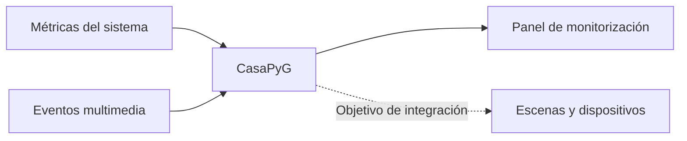

# CasaPyG · Monitorización y automatización del hogar

[← Portafolio](../README.md)

**Estado: prototipo.** Proyecto de automatización doméstica desarrollado en Python, con trabajo de monitorización del sistema y exploración de escenarios vinculados a reproducción multimedia.

## Enfoque

La implementación explorada incluye métricas de CPU, memoria y red, una interfaz local basada en Flask y trabajo de integración con eventos de Emby. El objetivo es relacionar señales del entorno con escenas domésticas, por ejemplo, iluminación durante reproducción multimedia.

**Esquema conceptual del prototipo.** Las conexiones a iluminación, asistentes domésticos y otros dispositivos requieren desarrollo y validación; no se anuncian como integraciones comerciales terminadas.

## Próximos hitos

- Corregir y consolidar módulos del prototipo.
- Completar los adaptadores de dispositivos y verificar compatibilidad real.
- Validar escenarios, fallos de red y recuperación antes de una instalación de uso continuo.

No se publican direcciones de red, configuraciones domésticas, credenciales ni código de implementación.
