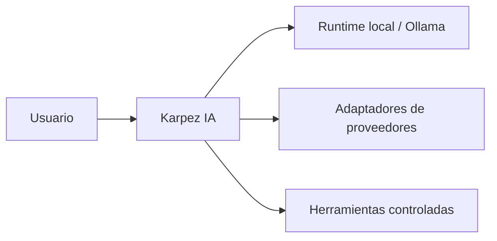

# Karpez IA · Entorno local y adaptadores de IA

[← Portafolio](../README.md)

**Estado: en desarrollo.** Proyecto orientado a trabajar con modelos locales y adaptar proveedores externos. No se presenta como un modelo fundacional propio ni como un producto comercial terminado.

## Enfoque

Separar la interfaz de trabajo, la ejecución local y los adaptadores de proveedor permite evolucionar cada integración de manera independiente. El proyecto contiene trabajo sobre un runtime local para Ollama y adaptadores de herramientas de proveedores, incluido Claude mediante herramientas CLI.

**Esquema de enfoque técnico**, no captura de una aplicación comercial ni prueba de integraciones completas. La disponibilidad y validación de cada adaptador deben comprobarse por separado. Los modelos y servicios pertenecen a sus respectivos proveedores.

## Próximos hitos

- Consolidar ejecución local y manejo de errores.
- Verificar credenciales, compatibilidad y funcionamiento de cada adaptador.
- Evaluar límites de permisos y costos antes de ampliar herramientas o acceso externo.

El repositorio de implementación permanece privado. Esta ficha describe el propósito y el estado del trabajo sin publicar el código.
